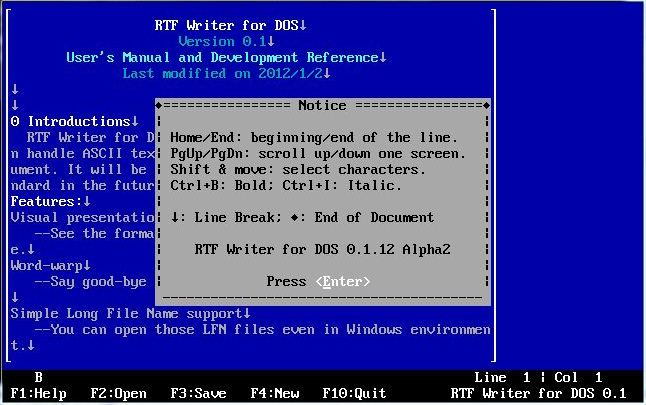

# RTF-Writer-DOS
 A coarse 16-bit RTF writer compiled in C for the DOS environment as a college student C programming project (made in 2011). Strictly in the text mode with only colors representing different formats. 

 
